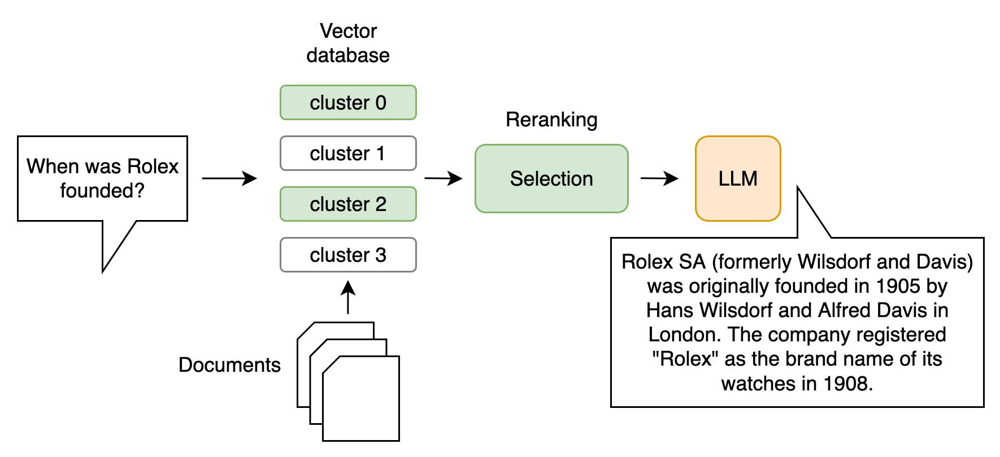
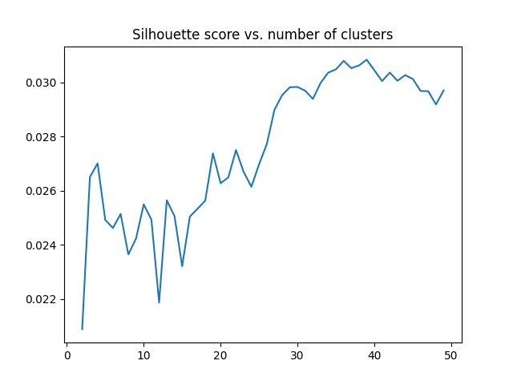
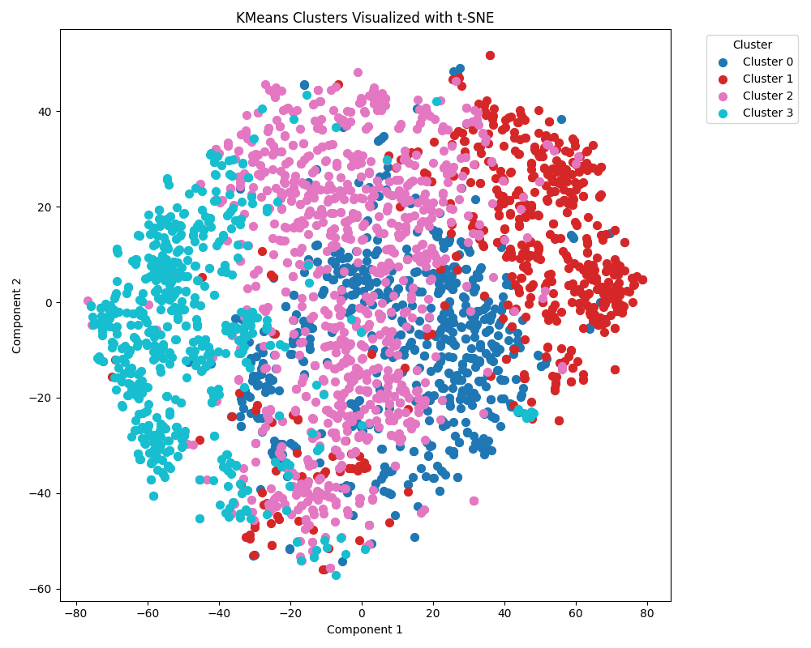

# Enhancing General Question Answering with Clustering

## 🕵🏻 How can clustering the data improve the retrieval methods of a RAG system?

## How to setup 🛠️

### Packages
To manage Python dependencies, `poetry` is used. Please, run

`poetry install`

to setup all necessary libraries (to run `poetry`, consider: [https://python-poetry.org/docs/](https://python-poetry.org/docs/)).

This project depends on `spacy` for tokenizing documents. `spacy` requires the tokenization pipeline `en_core_web_sm`. This can be downloaded with:

`poetry run python -m spacy download en_core_web_sm`

### Models
This project works with local models run by [Ollama](https://ollama.com/), which needs to be manually installed from their website: [https://ollama.com/](https://ollama.com/).

For embedding documents, [Nomic Embed](https://huggingface.co/nomic-ai/nomic-embed-text-v1), among others, is used, which is a fully open-sourced BERT based [model](https://static.nomic.ai/reports/2024_Nomic_Embed_Text_Technical_Report.pdf) by Nomic. This model can be downloaded with Ollama as follows:

`ollama pull nomic-embed-text`

For other embedding models consider [https://ollama.com/search?c=embedding](https://ollama.com/search?c=embedding). In particular, this project also uses [Mxbai-embed-large](https://huggingface.co/mixedbread-ai/mxbai-embed-large-v1) via Ollama.

The LLM that is used is Meta's open-weight [Llama 3 8B](https://ai.meta.com/blog/meta-llama-3/), which can be downloaded with:

`ollama pull llama3:8b`

To start ollama, run: 

`ollama serve`

### Preprocessing
All necessary preprocessing steps, including embedding document chunks and clustering, can be obtained by runnning:

`python pipeline_utils/run_all_preprocessing.py --embedding_model <model_name> --n_clusters <int>`

where `--embedding_model` is an embedding model from Ollama (e.g., `nomic-embed-text`) and `--n_clusters` the number of k clusters used in k-means (e.g., `4`).

If you want to add embeddings from another embedding model, run:

`python pipeline_utils/embedder.py --embedding_model <model_name>`

where `--embedding_model` must refer to another pre-installed model (see section Models).

### Classifier training
For the classifier, a [ModernBERT-base](https://huggingface.co/answerdotai/ModernBERT-base) bi-encoder is trained to classify question+chunk concatenations with respect to cluster labels from the clustering with k-means for embeddings. Based on a silhouette coefficient analysis, the local optimum of k=4 for the hagrids subset is chosen. To train the classifier, run:

`python pipeline_utils/bert_trainer.py --num_epochs <int>`

Training is being done with: AdamW, learning_rate=5e-5, and a linear scheduler for 3 epochs.

### Conversation
To engage with a conversation with Llama 3 8B that receives information through the RAG pipeline, simply run:

`python main.py`

### Experiments
All experiments can be executed with:

`./run_experiments.sh`

Please make sure, Ollama has been installed. Downloading the Ollama models and training a ModernBERT classifier will take considerable time.

## Data 📄
The ragbench subset [hagrid](https://huggingface.co/datasets/rungalileo/ragbench/viewer/hagrid) from Friel et al. (2025) which contains 2638 unique question-document pairs touching upon common knowledge is considered. Its resource is the MIRACL – a Wikipedia dataset from Zhang et al. (2023).

## Evaluation 🔎

There is one scripts under `evaluation/`:

[1] `retriever_eval.py` evaluates success of ground truth retrieval. Run evaluation with:

`python evaluation/retriever_eval.py --retriever <retriever_name> --embedding_model <model_name> <int> --top_k --top_clusters <int> --max_clusters <int>` 

where `--retriever` can be chosen from "bm25", "cosine", "MoBERT", "faiss", "rrf". `--embedding_model` should be an Ollama model such as `nomic-embed-text` when retrieval method is "cosine", "MoBERT", "faiss", or "rrf" and based cosine similarities. `--top_k` is the amount of documents to be retrieved and `--top_cluster` determines the number of clusters to consider for cluster constrained retrieval, `--max_cluster` tells the retriever (relevant for FAISS) the maximum number of clusters.

## Results 📊

#### Clustering
Optimal number of clusters for ragbench's subset `hagrid` according to slihouette coefficients:

There is a local optimum with k=4. A small number of clusters is also reasonable to provide the classifier with enough training examples for each cluster.

Clustering the chunks with k=4 would produce the following clusters:

| Cluster | n    | %     | 
| :------ | :--- | :---- |
| 0       | 624  | 0.236 |
| 1       | 521  | 0.197 |
| 2       | 923  | 0.349 | 
| 3       | 570  | 0.216 |
| in sum  | 2638 | 1.000 |

#### Success@k
The dataset contains unique query-answer pairs. The task for the retrieval pipeline is to find the correct answer for a given query. For this matter, success@k is a reasonable evaluation metric.

It is defined as:

- **Success@k = 1** if at least one relevant document is in the top *k* results  
- **Success@k = 0** otherwise

| Retrievers           | S@1   | S@3   | S@5   |
| :------------------- | :---- | :---- | :---- |
| BM25                 | 0.703 | 0.837 | 0.874 |
| Nomic                | 0.835 | 0.978 | 0.988 |
| Nomic-MoBERT(best)*  | 0.822 | 0.947 | 0.955 |
| Nomic-FAISS(c = 3/4) | 0.826 | 0.967 | 0.977 |
| Mxbai-embed-large    | 0.841 | 0.982 | 0.989 |

*Evaluated on a smaller test set (n=264).

This project also considers **Mean Reciprocal Ranks** (MRR) for the quality of the ranking of retrieved documents.

| Retrievers           | MRR k=3 | MRR k=5 | 
| :------------------- | :----   | :----   |
| BM25                 | 0.751   | 0.759   |
| Nomic                | 0.902   | 0.904   |
| Nomic-MoBERT(best)*  | 0.908   | 0.910   |
| Nomic-FAISS(c = 3/4) | 0.880   | 0.882   | 
| Mxbai-embed-large    | 0.892   | 0.895   | 

#### Latency
The average latency of each retrieval approach, excluding answer generation, is measure, too.

| Retrievers        | Avg. latency* of retrieval in sec. |
| :---------------- | :--------------------------------- |
| BM25              | 0.0042                             |
| Nomic             | 0.2338                             |
| Nomic-MoBERT(best)| 0.3194                             |
| Nomic-FAISS(best) | 0.0100                             |
| Mxbai-embed-large | 0.3007                             |
| RRF(BM25, Nomic)  | 0.2357                             |

*Using a MacbookAir M4 chip with 24GB GPU metals.

### Cluster based retrieval

Different cluster based retrieval methods are presented: (1) using a classifier that assigns relevant clusters to each input query (Nomic-MoBERT) or (2) by measuring the distance between query embeddings and cluster centroids (Nomic-FAISS).

| Clusters considered           | 3 of 4 | 2 of 4 | 1 of 4 |
| :---------------------------- | :----- | :----- | :----- |
| Success@1 Nomic-MoBERT, c = 4 | 0.822  | 0.780  | 0.633  |
| Success@3 Nomic-MoBERT, c = 4 | 0.947  | 0.886  | 0.723  |
| Success@5 Nomic-MoBERT, c = 4 | 0.955  | 0.894  | 0.731  |
| Success@1 Nomic-FAISS, c = 4  | 0.826  | 0.789  | 0.665  |
| Success@3 Nomic-FAISS, c = 4  | 0.967  | 0.918  | 0.762  |
| Success@5 Nomic-FAISS, c = 4  | 0.977  | 0.925  | 0.767  |

A trade-off between search-space reduction and latency can be observed:

| Avg. latency* with clusters in sec.| 4 of 4 | 3 of 4 | 2 of 4 | 1 of 4 |
| :--------------------------------- | :----- | :----- | :----- | :----- |
| Success@1 Nomic-MoBERT, c = 4      | 0.3651 | 0.3194 | 0.2691 | 0.2257 |

| Avg. latency* with clusters in sec.| 4 of 4 | 3 of 4 | 2 of 4 | 1 of 4 |
| :--------------------------------- | :----- | :----- | :----- | :----- |
| Success@1 Nomic-FAISS, c = 4       | 0.0100 | 0.0100 | 0.0099 | 0.0098 |

*Using a MacbookAir M4 chip with 24GB GPU metals.

## Resources

Friel, R., Belyi, M., and Sanyal, A. (2025). Ragbench: Explainable benchmark forretrieval-augmented generation systems.

Zhang, X., Thakur, N., Ogundepo, O., Kamalloo, E., Alfonso-Hermelo, D., Li, X.,
Liu, Q., Rezagholizadeh, M., and Lin, J. (2023). MIRACL: A multilingual retrieval dataset covering
18 diverse languages. Transactions of the Association for Computational Linguistics, 11:1114–1131.
